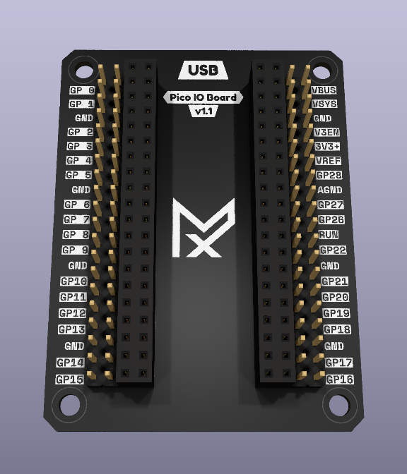
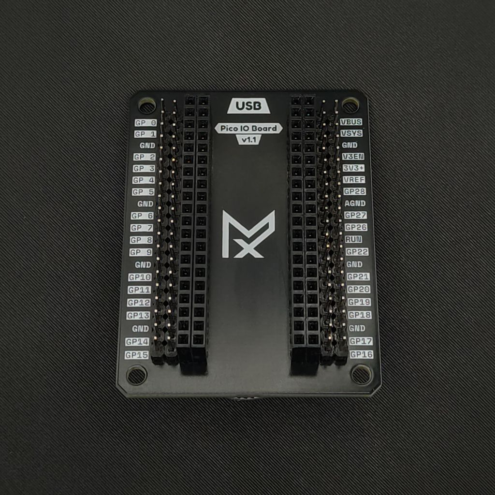
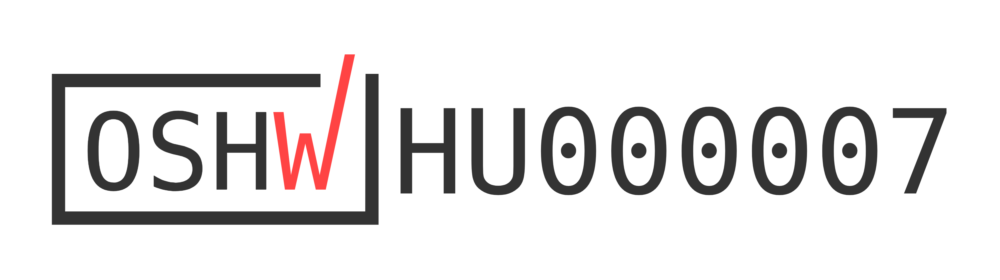

# Mechaxil Pico IO Board - [Documentation website](https://docs.mechaxil.com/docs/products/pico-io-board)

A clean, minimal Raspberry Pi Pico-compatible breakout board designed for easy access to all GPIO pins.

  
  

## Overview

The Mechaxil Pico IO Board expands the Raspberry Pi Pico pins so it's easier to use for prototyping.

Designed with usability, readability, and clean aesthetics in mind.

Perfect for prototyping, education, embedded development, and quick testing setups.

This board is available for purchase via the Mechaxil webshop:
[Mechaxil Webshop](https://mechaxil.com/products/pico-io-board)

## Features

- Full GPIO breakout  
- Clearly labeled pinout on silkscreen  
- Single-row female header  
- Dual-row male headers  
- Clean minimal design  

## Use Cases

- Rapid prototyping  
- Educational electronics kits  
- Embedded system development  
- DIY projects  

## Hardware

- Compatible with Raspberry Pi Pico and Pico-compatible boards  
- Standard 2.54 mm header spacing  
- Compact form factor  

## OSHW & License

As of 2026 May 8th this project was certified by OSHWA

  

This project is licensed under the CERN Open Hardware Licence Version 2 - Weakly Reciprocal (CERN-OHL-W).

You are free to use, modify, manufacture, and sell.

Condition:
- Any modifications to the design must also be shared under the same license  

> [!IMPORTANT]
>
> ## Trademark & Branding Notice
>
> "Mechaxil" and the Mechaxil logo are trademarks of Mechaxil (Závoczki Attila e.v.).
> This license does not grant permission to use the Mechaxil name, logo, or branding for commercial or promotional purposes without prior written permission.
>
> If you manufacture, distribute, or sell this design (modified or unmodified):
>
> * You must remove the Mechaxil logo
> * You must remove any "Approved by Mechaxil" markings
> * You must not imply that your product is an official Mechaxil product
> * You must clearly state: "Original design by Mechaxil"
>
> This ensures transparency and avoids confusion between official Mechaxil products and third-party derivatives.

> [!IMPORTANT]
> ## Raspberry Pi Disclaimer
> "Raspberry Pi" is a trademark of the Raspberry Pi Foundation.
> This project is not affiliated with, endorsed by, or sponsored by the Raspberry Pi Foundation or Raspberry Pi Ltd.
> The term is used only for compatibility reference.

## Open Hardware

All design files are provided as schematics, PCB layouts, and production files.

Feel free to build, sell, improve, and share.
